# Monitor-and-test-Internet-connectivity

## Fluxo de funcionamento

```mermaid
flowchart TD

A[Inicialização do ESP32] --> B[Testa R1]
B --> C[Testa R2]
C --> D[Testa R3]

D --> E[Atualiza status dos links]

E --> F{Mudou o estado dos links?}

F -- Sim --> G[Ativa buzzer e sinaleira]
G --> H[Envia mensagem no Telegram]

F -- Não --> I[Aguarda intervalo]

H --> I

I --> J{Durante espera}

J --> K[Leitura botão ACK]
J --> L[Controle buzzer/sinaleira]
J --> M[Verifica comandos Telegram]

K --> N[Volta para novo ciclo]
L --> N
M --> N

N --> B
```

Sistema de monitoramento de múltiplas conexões de internet usando <strong data-start="374" data-end="391">ESP32 + W5500</strong>, com alarme local e notificações via Telegram.

<h2 data-start="440" data-end="454">Visão geral</h2>

Este projeto monitora até <strong data-start="481" data-end="518">3 links de internet independentes</strong> (roteadores diferentes). 
Quando um link falha, o sistema:

<ul data-start="580" data-end="716">
<li data-start="580" data-end="606">

Ativa buzzer e sinaleira

</li>
<li data-start="607" data-end="640">

Mostra o status no display OLED

</li>
<li data-start="641" data-end="668">

Envia alerta via Telegram

</li>
<li data-start="669" data-end="716">

Permite consulta remota com comando <code data-start="707" data-end="716">/status</code>

</li>
</ul>

Projetado para ambientes reais (lojas, oficinas, escritórios) onde quedas de fibra são comuns.

<h2 data-start="819" data-end="837">Funcionalidades</h2>
<ul data-start="838" data-end="1142">
<li data-start="838" data-end="883">

Monitoramento sequencial de até <strong data-start="872" data-end="883">3 links</strong>

</li>
<li data-start="884" data-end="925">

Detecção de falha por teste TCP externo

</li>
<li data-start="926" data-end="962">

Notificação automática no Telegram

</li>
<li data-start="963" data-end="989">

Comando remoto <code data-start="980" data-end="989">/status</code>

</li>
<li data-start="990" data-end="1044">

Alarme local:

<ul data-start="1008" data-end="1044">
<li data-start="1008" data-end="1025">

buzzer pulsante

</li>
<li data-start="1028" data-end="1044">

sinaleira fixa

</li>
</ul>
</li>
<li data-start="1045" data-end="1082">

Botão <strong data-start="1053" data-end="1060">ACK</strong> para silenciar buzzer

</li>
<li data-start="1083" data-end="1142">

Envio via <strong data-start="1095" data-end="1118">Ethernet disponível</strong> (sem depender de Wi-Fi)

</li>
</ul>

<h2 data-start="1149" data-end="1170">Hardware utilizado</h2>
<ul data-start="1171" data-end="1391">
<li data-start="1171" data-end="1185">

ESP32 DevKit

</li>
<li data-start="1186" data-end="1217">

3× módulos Ethernet <strong data-start="1208" data-end="1217">W5500</strong>

</li>
<li data-start="1218" data-end="1246">

Display OLED SSD1306 (I2C)

</li>

<li data-start="1301" data-end="1326">

Módulo relé para a sinaleira

</li>
<li data-start="1327" data-end="1339">

Módulo relé para o Buzzer 12V

</li>
<li data-start="1340" data-end="1354">

Botão de ACK

</li>
<li data-start="1355" data-end="1391">

Fonte 12V + step-down para 5V/3.3V

</li>
</ul>

<h2 data-start="1398" data-end="1420">Ligações principais</h2>
<h3 data-start="1422" data-end="1445">SPI – módulos W5500</h3>

<table data-start="1446" data-end="1566" class="w-fit min-w-(--thread-content-width)"><thead data-start="1446" data-end="1463"><tr data-start="1446" data-end="1463"><th data-start="1446" data-end="1455" data-col-size="sm" class="">Função</th><th data-start="1455" data-end="1463" data-col-size="sm" class="">GPIO</th></tr></thead><tbody data-start="1482" data-end="1566"><tr data-start="1482" data-end="1494"><td data-start="1482" data-end="1488" data-col-size="sm">SCK</td><td data-start="1488" data-end="1494" data-col-size="sm">18</td></tr><tr data-start="1495" data-end="1508"><td data-start="1495" data-end="1502" data-col-size="sm">MISO</td><td data-start="1502" data-end="1508" data-col-size="sm">19</td></tr><tr data-start="1509" data-end="1522"><td data-start="1509" data-end="1516" data-col-size="sm">MOSI</td><td data-start="1516" data-end="1522" data-col-size="sm">23</td></tr><tr data-start="1523" data-end="1536"><td data-start="1523" data-end="1531" data-col-size="sm">CS R1</td><td data-start="1531" data-end="1536" data-col-size="sm">5</td></tr><tr data-start="1537" data-end="1551"><td data-start="1537" data-end="1545" data-col-size="sm">CS R2</td><td data-start="1545" data-end="1551" data-col-size="sm">17</td></tr><tr data-start="1552" data-end="1566"><td data-start="1552" data-end="1560" data-col-size="sm">CS R3</td><td data-start="1560" data-end="1566" data-col-size="sm">16</td></tr></tbody></table>

<button aria-label="Copiar tabela" class="hover:bg-token-bg-tertiary text-token-text-secondary my-1 rounded-sm p-1 transition-opacity group-[:not(:hover):not(:focus-within)]:pointer-events-none group-[:not(:hover):not(:focus-within)]:opacity-0"><svg xmlns="http://www.w3.org/2000/svg" width="20" height="20" aria-hidden="true" class="icon"><use href="/cdn/assets/sprites-core-j9921kii.svg#ce3544" fill="currentColor"></use></svg></button>

<h3 data-start="1568" data-end="1590">I2C – display OLED</h3>

<table data-start="1591" data-end="1652" class="w-fit min-w-(--thread-content-width)"><thead data-start="1591" data-end="1608"><tr data-start="1591" data-end="1608"><th data-start="1591" data-end="1600" data-col-size="sm" class="">Função</th><th data-start="1600" data-end="1608" data-col-size="sm" class="">GPIO</th></tr></thead><tbody data-start="1627" data-end="1652"><tr data-start="1627" data-end="1639"><td data-start="1627" data-end="1633" data-col-size="sm">SDA</td><td data-start="1633" data-end="1639" data-col-size="sm">21</td></tr><tr data-start="1640" data-end="1652"><td data-start="1640" data-end="1646" data-col-size="sm">SCL</td><td data-start="1646" data-end="1652" data-col-size="sm">22</td></tr></tbody></table>

<button aria-label="Copiar tabela" class="hover:bg-token-bg-tertiary text-token-text-secondary my-1 rounded-sm p-1 transition-opacity group-[:not(:hover):not(:focus-within)]:pointer-events-none group-[:not(:hover):not(:focus-within)]:opacity-0"><svg xmlns="http://www.w3.org/2000/svg" width="20" height="20" aria-hidden="true" class="icon"><use href="/cdn/assets/sprites-core-j9921kii.svg#ce3544" fill="currentColor"></use></svg></button>

<h3 data-start="1654" data-end="1672">Alarme e botão</h3>

<table data-start="1673" data-end="1762" class="w-fit min-w-(--thread-content-width)"><thead data-start="1673" data-end="1690"><tr data-start="1673" data-end="1690"><th data-start="1673" data-end="1682" data-col-size="sm" class="">Função</th><th data-start="1682" data-end="1690" data-col-size="sm" class="">GPIO</th></tr></thead><tbody data-start="1709" data-end="1762"><tr data-start="1709" data-end="1727"><td data-start="1709" data-end="1721" data-col-size="sm">Sinaleira</td><td data-start="1721" data-end="1727" data-col-size="sm">14</td></tr><tr data-start="1728" data-end="1743"><td data-start="1728" data-end="1737" data-col-size="sm">Buzzer</td><td data-start="1737" data-end="1743" data-col-size="sm">12</td></tr><tr data-start="1744" data-end="1762"><td data-start="1744" data-end="1756" data-col-size="sm">Botão ACK</td><td data-start="1756" data-end="1762" data-col-size="sm">27</td></tr></tbody></table>

<button aria-label="Copiar tabela" class="hover:bg-token-bg-tertiary text-token-text-secondary my-1 rounded-sm p-1 transition-opacity group-[:not(:hover):not(:focus-within)]:pointer-events-none group-[:not(:hover):not(:focus-within)]:opacity-0"><svg xmlns="http://www.w3.org/2000/svg" width="20" height="20" aria-hidden="true" class="icon"><use href="/cdn/assets/sprites-core-j9921kii.svg#ce3544" fill="currentColor"></use></svg></button>

<h2 data-start="1769" data-end="1796">Funcionamento do sistema</h2>
<ol data-start="1797" data-end="2156">
<li data-start="1797" data-end="1837">

O ESP32 testa cada link em sequência.

</li>
<li data-start="1838" data-end="1933">

Se um link falhar:

<ul data-start="1863" data-end="1933">
<li data-start="1863" data-end="1877">

buzzer pulsa

</li>
<li data-start="1881" data-end="1899">

sinaleira acende

</li>
<li data-start="1903" data-end="1933">

mensagem enviada no Telegram

</li>
</ul>
</li>
<li data-start="1934" data-end="1990">

Se outro link falhar:

<ul data-start="1962" data-end="1990">
<li data-start="1962" data-end="1990">

nova notificação é enviada

</li>
</ul>
</li>
<li data-start="1991" data-end="2084">

Se todos caírem:

<ul data-start="2014" data-end="2084">
<li data-start="2014" data-end="2037">

alarme local continua

</li>
<li data-start="2041" data-end="2084">

notificação é enviada quando algum voltar

</li>
</ul>
</li>
<li data-start="2085" data-end="2156">

Botão <strong data-start="2094" data-end="2101">ACK</strong>:

<ul data-start="2106" data-end="2156">
<li data-start="2106" data-end="2125">

silencia o buzzer

</li>
<li data-start="2129" data-end="2156">

mantém a sinaleira ligada

</li>
</ul>
</li>
</ol>

<h2 data-start="2163" data-end="2197">Exemplo de mensagem no Telegram</h2>
<pre class="overflow-visible! px-0!" data-start="2198" data-end="2270">

yaml

<button class="flex gap-1 items-center select-none py-1" aria-label="Copiar"><svg xmlns="http://www.w3.org/2000/svg" width="20" height="20" aria-hidden="true" class="icon-sm"><use href="/cdn/assets/sprites-core-j9921kii.svg#ce3544" fill="currentColor"></use></svg>Copiar código</button>

<code class="whitespace-pre!">üö® ALERTA: Mudanca no status dos links.

R1: FALHA
R2: OK
R3: OK
</code>

</pre>

Comando manual:

<pre class="overflow-visible! px-0!" data-start="2289" data-end="2304">

bash

<button class="flex gap-1 items-center select-none py-1" aria-label="Copiar"><svg xmlns="http://www.w3.org/2000/svg" width="20" height="20" aria-hidden="true" class="icon-sm"><use href="/cdn/assets/sprites-core-j9921kii.svg#ce3544" fill="currentColor"></use></svg>Copiar código</button>

<code class="whitespace-pre!">/status
</code>

</pre>

Resposta:

<pre class="overflow-visible! px-0!" data-start="2317" data-end="2373">

yaml

<button class="flex gap-1 items-center select-none py-1" aria-label="Copiar"><svg xmlns="http://www.w3.org/2000/svg" width="20" height="20" aria-hidden="true" class="icon-sm"><use href="/cdn/assets/sprites-core-j9921kii.svg#ce3544" fill="currentColor"></use></svg>Copiar código</button>

<code class="whitespace-pre!">Status atual dos links:

R1: OK
R2: FALHA
R3: OK
</code>

</pre>

<h2 data-start="2380" data-end="2407">Configuração do Telegram</h2>
<h3 data-start="2409" data-end="2427">1) Criar o bot</h3>

No Telegram, abra:

<pre class="overflow-visible! px-0!" data-start="2447" data-end="2465">

css

<button class="flex gap-1 items-center select-none py-1" aria-label="Copiar"><svg xmlns="http://www.w3.org/2000/svg" width="20" height="20" aria-hidden="true" class="icon-sm"><use href="/cdn/assets/sprites-core-j9921kii.svg#ce3544" fill="currentColor"></use></svg>Copiar código</button>

<code class="whitespace-pre!">@BotFather
</code>

</pre>

Envie:

<pre class="overflow-visible! px-0!" data-start="2474" data-end="2489">

bash

<button class="flex gap-1 items-center select-none py-1" aria-label="Copiar"><svg xmlns="http://www.w3.org/2000/svg" width="20" height="20" aria-hidden="true" class="icon-sm"><use href="/cdn/assets/sprites-core-j9921kii.svg#ce3544" fill="currentColor"></use></svg>Copiar código</button>

<code class="whitespace-pre!">/newbot
</code>

</pre>

Guarde o <strong data-start="2500" data-end="2513">BOT_TOKEN</strong>.

<h3 data-start="2521" data-end="2547">2) Descobrir o CHAT_ID</h3>
<ol data-start="2548" data-end="2602">
<li data-start="2548" data-end="2580">

Envie uma mensagem para o bot

</li>
<li data-start="2581" data-end="2602">

Abra no navegador:

</li>
</ol>
<pre class="overflow-visible! px-0!" data-start="2604" data-end="2660">

bash

<button class="flex gap-1 items-center select-none py-1" aria-label="Copiar"><svg xmlns="http://www.w3.org/2000/svg" width="20" height="20" aria-hidden="true" class="icon-sm"><use href="/cdn/assets/sprites-core-j9921kii.svg#ce3544" fill="currentColor"></use></svg>Copiar código</button>

<code class="whitespace-pre!">https://api.telegram.org/botSEU_TOKEN/getUpdates
</code>

</pre>

Procure:

<pre class="overflow-visible! px-0!" data-start="2671" data-end="2701">

json

<button class="flex gap-1 items-center select-none py-1" aria-label="Copiar"><svg xmlns="http://www.w3.org/2000/svg" width="20" height="20" aria-hidden="true" class="icon-sm"><use href="/cdn/assets/sprites-core-j9921kii.svg#ce3544" fill="currentColor"></use></svg>Copiar código</button>

<code class="whitespace-pre!">"chat":{"id":123456789
</code>

</pre>

Esse número é o <strong data-start="2719" data-end="2730">CHAT_ID</strong>.

<h3 data-start="2738" data-end="2765">3) Configurar no código</h3>

No firmware:

<pre class="overflow-visible! px-0!" data-start="2780" data-end="2852">

cpp

<button class="flex gap-1 items-center select-none py-1" aria-label="Copiar"><svg xmlns="http://www.w3.org/2000/svg" width="20" height="20" aria-hidden="true" class="icon-sm"><use href="/cdn/assets/sprites-core-j9921kii.svg#ce3544" fill="currentColor"></use></svg>Copiar código</button>

<code class="whitespace-pre! language-cpp">#define BOT_TOKEN "SEU_TOKEN"
#define CHAT_ID   "SEU_CHAT_ID"
</code>

</pre>

<h2 data-start="2859" data-end="2877">Comandos do bot</h2>

<table data-start="2878" data-end="2965" class="w-fit min-w-(--thread-content-width)"><thead data-start="2878" data-end="2898"><tr data-start="2878" data-end="2898"><th data-start="2878" data-end="2888" data-col-size="sm" class="">Comando</th><th data-start="2888" data-end="2898" data-col-size="sm" class="">Função</th></tr></thead><tbody data-start="2918" data-end="2965"><tr data-start="2918" data-end="2965"><td data-start="2918" data-end="2930" data-col-size="sm"><code data-start="2920" data-end="2929">/status</code></td><td data-start="2930" data-end="2965" data-col-size="sm">Mostra o estado atual dos links</td></tr></tbody></table>

<button aria-label="Copiar tabela" class="hover:bg-token-bg-tertiary text-token-text-secondary my-1 rounded-sm p-1 transition-opacity group-[:not(:hover):not(:focus-within)]:pointer-events-none group-[:not(:hover):not(:focus-within)]:opacity-0"><svg xmlns="http://www.w3.org/2000/svg" width="20" height="20" aria-hidden="true" class="icon"><use href="/cdn/assets/sprites-core-j9921kii.svg#ce3544" fill="currentColor"></use></svg></button>

<h2 data-start="2972" data-end="2997">Bibliotecas utilizadas</h2>

Instale pelo Gerenciador de Bibliotecas do Arduino:

<ul data-start="3051" data-end="3123">
<li data-start="3051" data-end="3066">

EthernetESP32

</li>
<li data-start="3067" data-end="3089">

UniversalTelegramBot

</li>
<li data-start="3090" data-end="3108">

Adafruit SSD1306

</li>
<li data-start="3109" data-end="3123">

Adafruit GFX

</li>
</ul>

<h2 data-start="3310" data-end="3340">Possíveis melhorias futuras</h2>
<ul data-start="3341" data-end="3508">
<li data-start="3341" data-end="3375">

Registro de quedas com timestamp

</li>
<li data-start="3376" data-end="3416">

Mensagens periódicas enquanto em falha

</li>
<li data-start="3417" data-end="3452">

Comando <code data-start="3427" data-end="3439">/silenciar</code> via Telegram

</li>
<li data-start="3453" data-end="3474">

Dashboard web local

</li>
<li data-start="3475" data-end="3508">

RTC ou NTP para horário preciso

</li>
</ul>

<h2 data-start="3515" data-end="3525">Licença</h2>

Projeto aberto para uso educacional e comercial.

</ul>

https://github.com/Networking-for-Arduino/EthernetENC

https://github.com/dvarrel/ESPping
https://github.com/marian-craciunescu/ESP32Ping

<h1 data-start="223" data-end="249">Fontes principais usadas</h1>
<h2 data-start="251" data-end="293">1) Telegram Bot API (protocolo oficial)</h2>

<a data-start="294" data-end="356" rel="noopener" target="_new" class="decorated-link" href="https://core.telegram.org/bots/api">Telegram Bot API oficial<svg xmlns="http://www.w3.org/2000/svg" width="20" height="20" aria-hidden="true" data-rtl-flip="" class="block h-[0.75em] w-[0.75em] stroke-current stroke-[0.75]"><use href="/cdn/assets/sprites-core-j9921kii.svg#304883" fill="currentColor"></use></svg></a>

<ul data-start="359" data-end="480">
<li data-start="359" data-end="388">

Documentação oficial da API

</li>
<li data-start="389" data-end="480">

Explica:

<ul data-start="402" data-end="480">
<li data-start="402" data-end="417">

<code data-start="404" data-end="417">sendMessage</code>

</li>
<li data-start="420" data-end="434">

<code data-start="422" data-end="434">getUpdates</code>

</li>
<li data-start="437" data-end="462">

estrutura das mensagens

</li>
<li data-start="465" data-end="480">

uso via HTTPS

</li>
</ul>
</li>
</ul>

Trecho importante:

<blockquote data-start="501" data-end="640">

“The Bot API is an HTTP-based interface created for developers keen on building bots for Telegram.” <a href="https://core.telegram.org/bots/api" target="_blank" rel="noopener" alt="https://core.telegram.org/bots/api" class="flex h-4.5 overflow-hidden rounded-xl px-2 text-[9px] font-medium transition-colors duration-150 ease-in-out text-token-text-secondary! bg-[#F4F4F4]! dark:bg-[#303030]!" style="max-width: 53px;">Telegram</a>

</blockquote>

<h2 data-start="647" data-end="706">2) Biblioteca UniversalTelegramBot (usada no seu código)</h2>

<a data-start="707" data-end="803" rel="noopener" target="_new" class="decorated-link" href="https://github.com/witnessmenow/Universal-Arduino-Telegram-Bot">UniversalTelegramBot no GitHub<svg xmlns="http://www.w3.org/2000/svg" width="20" height="20" aria-hidden="true" data-rtl-flip="" class="block h-[0.75em] w-[0.75em] stroke-current stroke-[0.75]"><use href="/cdn/assets/sprites-core-j9921kii.svg#304883" fill="currentColor"></use></svg></a>

<ul data-start="806" data-end="929">
<li data-start="806" data-end="833">

Biblioteca usada no ESP32

</li>
<li data-start="834" data-end="893">

Base para:

<ul data-start="849" data-end="893">
<li data-start="849" data-end="870">

<code data-start="851" data-end="870">bot.sendMessage()</code>

</li>
<li data-start="873" data-end="893">

<code data-start="875" data-end="893">bot.getUpdates()</code>

</li>
</ul>
</li>
<li data-start="894" data-end="929">

Exemplos de uso com ESP32 e HTTPS

</li>
</ul>

<h2 data-start="936" data-end="977">3) Documentação do chip Ethernet W5500</h2>

<a data-start="978" data-end="1070" rel="noopener" target="_new" class="decorated-link" href="https://docs.wiznet.io/Product/Chip/Ethernet/W5500">Documentação oficial do W5500 (Wiznet)<svg xmlns="http://www.w3.org/2000/svg" width="20" height="20" aria-hidden="true" data-rtl-flip="" class="block h-[0.75em] w-[0.75em] stroke-current stroke-[0.75]"><use href="/cdn/assets/sprites-core-j9921kii.svg#304883" fill="currentColor"></use></svg></a>

<ul data-start="1073" data-end="1185">
<li data-start="1073" data-end="1113">

Manual técnico do controlador Ethernet

</li>
<li data-start="1114" data-end="1185">

Explica:

<ul data-start="1127" data-end="1185">
<li data-start="1127" data-end="1132">

SPI

</li>
<li data-start="1135" data-end="1152">

sockets TCP/UDP

</li>
<li data-start="1155" data-end="1185">

funcionamento de DHCP e rede

</li>
</ul>
</li>
</ul>

<h2 data-start="1192" data-end="1259">4) GPIO e interrupções no ESP32 (documentação oficial Espressif)</h2>

<a data-start="1260" data-end="1392" rel="noopener" target="_new" class="decorated-link" href="https://docs.espressif.com/projects/esp-idf/en/latest/esp32/api-reference/peripherals/gpio.html">ESP32 GPIO – documentação oficial<svg xmlns="http://www.w3.org/2000/svg" width="20" height="20" aria-hidden="true" data-rtl-flip="" class="block h-[0.75em] w-[0.75em] stroke-current stroke-[0.75]"><use href="/cdn/assets/sprites-core-j9921kii.svg#304883" fill="currentColor"></use></svg></a>

<ul data-start="1395" data-end="1520">
<li data-start="1395" data-end="1428">

Guia oficial dos pinos do ESP32

</li>
<li data-start="1429" data-end="1520">

Base para:

<ul data-start="1444" data-end="1520">
<li data-start="1444" data-end="1468">

uso de GPIO27 no botão

</li>
<li data-start="1471" data-end="1485">

interrupções

</li>
<li data-start="1488" data-end="1520">

estados de boot (GPIO12, etc.)

</li>
</ul>
</li>
</ul>

<h2 data-start="1527" data-end="1570">5) Referência de interrupções no Arduino</h2>

Link direto: 
<a data-start="1584" data-end="1675" rel="noopener" target="_new" class="decorated-link cursor-pointer">https://www.arduino.cc/reference/en/language/functions/external-interrupts/attachinterrupt/<svg xmlns="http://www.w3.org/2000/svg" width="20" height="20" aria-hidden="true" data-rtl-flip="" class="block h-[0.75em] w-[0.75em] stroke-current stroke-[0.75]"><use href="/cdn/assets/sprites-core-j9921kii.svg#304883" fill="currentColor"></use></svg></a>

Documenta:

<ul data-start="1688" data-end="1752">
<li data-start="1688" data-end="1709">

<code data-start="1690" data-end="1709">attachInterrupt()</code>

</li>
<li data-start="1710" data-end="1752">

modos:

<ul data-start="1721" data-end="1752">
<li data-start="1721" data-end="1729">

RISING

</li>
<li data-start="1732" data-end="1741">

FALLING

</li>
<li data-start="1744" data-end="1752">

CHANGE

</li>
</ul>
</li>
</ul>

Base para o ACK por interrupção.

<h1 data-start="1793" data-end="1843">Outras referências técnicas usadas (conceituais)</h1>

Essas não são de um único link específico, mas são práticas comuns documentadas em:

<h3 data-start="1929" data-end="1949">Redes embarcadas</h3>
<ul data-start="1950" data-end="2044">
<li data-start="1950" data-end="1990">

Sequenciamento de múltiplas interfaces

</li>
<li data-start="1991" data-end="2008">

Failover lógico

</li>
<li data-start="2009" data-end="2044">

Testes TCP para detectar internet

</li>
</ul>
<h3 data-start="2046" data-end="2079">Sistemas de alarme industrial</h3>
<ul data-start="2080" data-end="2151">
<li data-start="2080" data-end="2113">

ACK local com buzzer silenciado

</li>
<li data-start="2114" data-end="2130">

Sinaleira fixa

</li>
<li data-start="2131" data-end="2151">

Notificação remota

</li>
</ul>

<h1 data-start="2158" data-end="2189">Resumo das tecnologias usadas</h1>

<table data-start="2190" data-end="2518" class="w-fit min-w-(--thread-content-width)"><thead data-start="2190" data-end="2225"><tr data-start="2190" data-end="2225"><th data-start="2190" data-end="2209" data-col-size="sm" class="">Parte do sistema</th><th data-start="2209" data-end="2225" data-col-size="md" class="">Base técnica</th></tr></thead><tbody data-start="2261" data-end="2518"><tr data-start="2261" data-end="2314"><td data-start="2261" data-end="2272" data-col-size="sm">Telegram</td><td data-start="2272" data-end="2314" data-col-size="md">Bot API oficial + UniversalTelegramBot</td></tr><tr data-start="2315" data-end="2366"><td data-start="2315" data-end="2326" data-col-size="sm">Ethernet</td><td data-start="2326" data-end="2366" data-col-size="md">W5500 datasheet + biblioteca Arduino</td></tr><tr data-start="2367" data-end="2409"><td data-start="2367" data-end="2375" data-col-size="sm">ESP32</td><td data-start="2375" data-end="2409" data-col-size="md">documentação oficial Espressif</td></tr><tr data-start="2410" data-end="2452"><td data-start="2410" data-end="2422" data-col-size="sm">Botão ACK</td><td data-start="2422" data-end="2452" data-col-size="md">interrupções Arduino/ESP32</td></tr><tr data-start="2453" data-end="2518"><td data-start="2453" data-end="2469" data-col-size="sm">Monitoramento</td><td data-start="2469" data-end="2518" data-col-size="md">lógica de failMask (técnica padrão de estado)</td></tr></tbody></table>

<button aria-label="Copiar tabela" class="hover:bg-token-bg-tertiary text-token-text-secondary my-1 rounded-sm p-1 transition-opacity group-[:not(:hover):not(:focus-within)]:pointer-events-none group-[:not(:hover):not(:focus-within)]:opacity-0"><svg xmlns="http://www.w3.org/2000/svg" width="20" height="20" aria-hidden="true" class="icon"><use href="/cdn/assets/sprites-core-j9921kii.svg#ce3544" fill="currentColor"></use></svg></button>

</ul>

